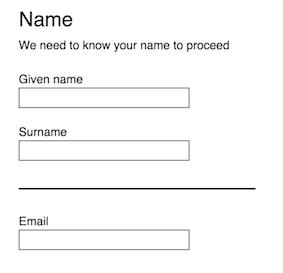
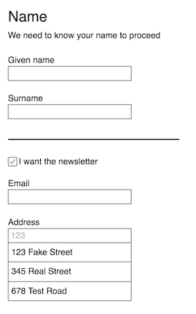

# {JSON Forms Specification}

**A SPECIFICATION FOR BUILDING FORMS IN JSON**

🔖 [View the Specification](/specification.md)

---

## Overview

When building web based forms, we face many problems including:

- How can we reuse form logic across projects with different backend stacks? 
- How can we reuse form logic across projects that use different front end frameworks/technologies?

This specification attempts to bridge the gap between the client and the backend by representing a form using a standard JSON object.

### A simple example

- The object below defines a simple (single step) form with a name section, and an email field.
- Nested inside the name section are a first and last name field.
- The form is pre-populated with some initial values.

The consumer of this object is a form builder, which will automatically build a form.

The initial target is a React based form builder, but this spec is platform and framework agnostic.

```js
{
  "version": "0",
  "id": "form-id",
  "initialValues": {
    "name": {
      "first": "Joan",
      "last": "Smith"
    },
    "email": "joan.smith@gmail.com",
  },
  "fields": [
    { 
      "id": "name", 
      "type": "section",
      "data": {
        "title": "Your name",
        "description": "We need to know your name to proceed"
      },
      "fields": [
        { 
          "id": "first", 
          "type": "text",
          "data": {
            "label": "Given name"
          }
        },
        { 
          "id": "name", 
          "type": "text",
          "data": {
            "label": "Surname"
          }
        }
      ]
    },
    { 
      "id": "email",
      "type": "text"
    }
  ]
}
```

Here is one of many ways a form builder might render the above form:



### A more advanced example

Beyond just defining fields and displaying them, this spec supports dynamic form rules, validation and completely custom field types.

- The object below defines an advanced form with a name section, a newsletter signup checkbox, an email field and a custom address typeahead.
- The name section has a title and description
- The first and last name fields have labels
- The email field will only show when the checkbox is ticked. (See [form rules](#Form_rules))
- The email field has a validation rule with a custom message.
- The address typeahead talks to the endpoint it's provided to suggest addresses to the user as they type.

```js
{
  "version": "0",
  "id": "form-id",
  "fields": [
    { 
      "id": "name", 
      "type": "section",
      "data": {
        "title": "Your name",
        "description": "We need to know your name to proceed"
      },
      "fields": [
        { 
          "id": "first", 
          "type": "text",
          "data": {
            "label": "Given name"
          }
        },
        { 
          "id": "name", 
          "type": "text",
          "data": {
            "label": "Surname"
          }
        }
      ],
    },
    { 
      "id": "signUpForNewsletter",
      "type": "checkbox"
    },
    { 
      "id": "email",
      "type": "text"
      "rules": [
        {
          "action": "show",
          "when": { 
            "eq": ["signUpForNewsletter", true] 
          }
        }
      ],
      "validators": [
        {
          "type": "email",
          "message": "Please enter a valid email address"
        }
      ]
    },
    { 
      "id": "address",
      "type": "address-typeahead"
      "data": {
        "endpoint": "https://address.com"
      }
    }
  ]
}
```

Here is one of many ways a form builder might render the above form:



## Update History

- 17 April 2019: 1.0 Released on Github
